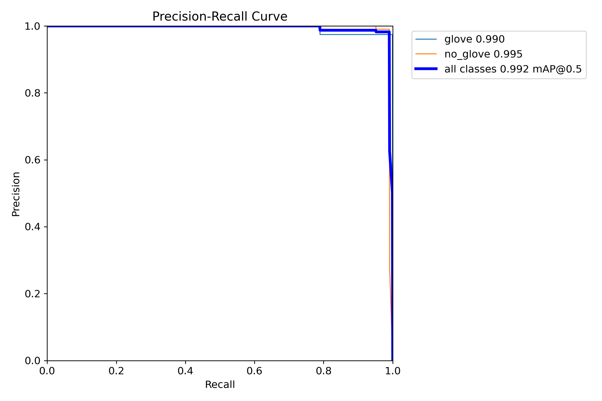
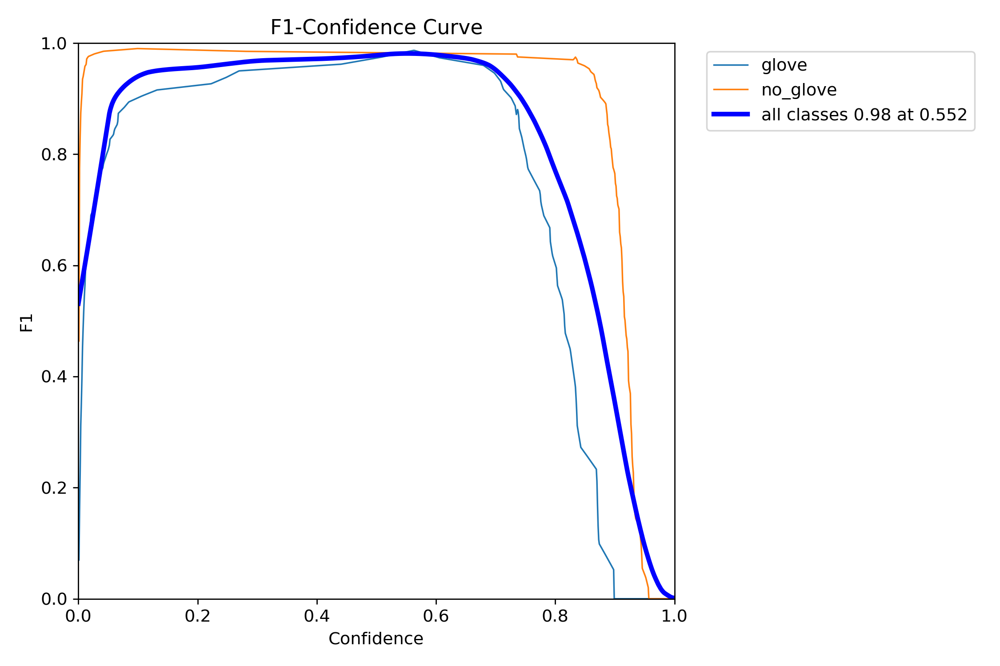
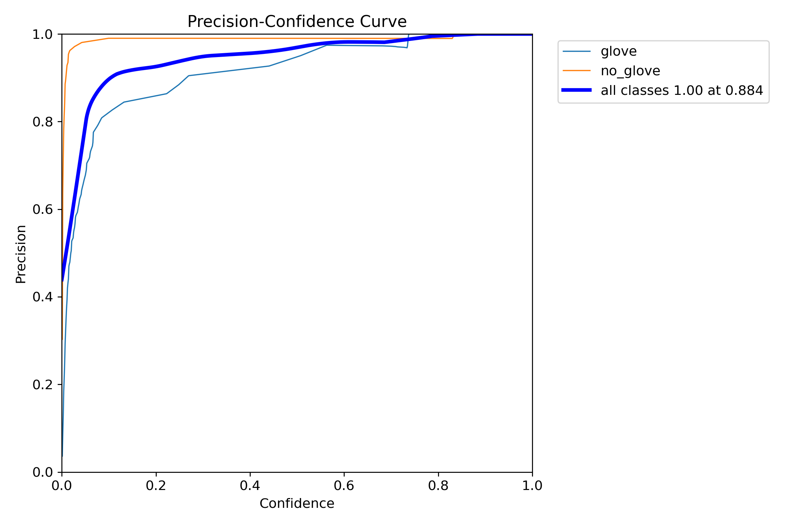
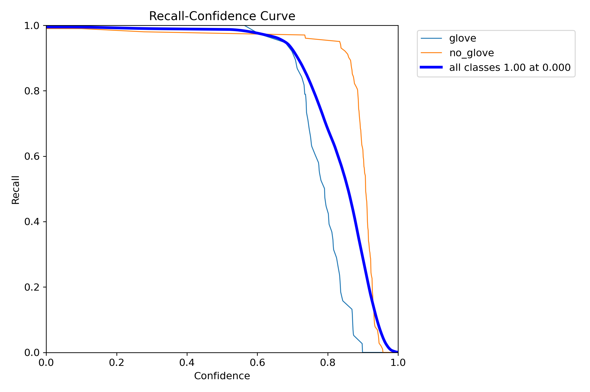
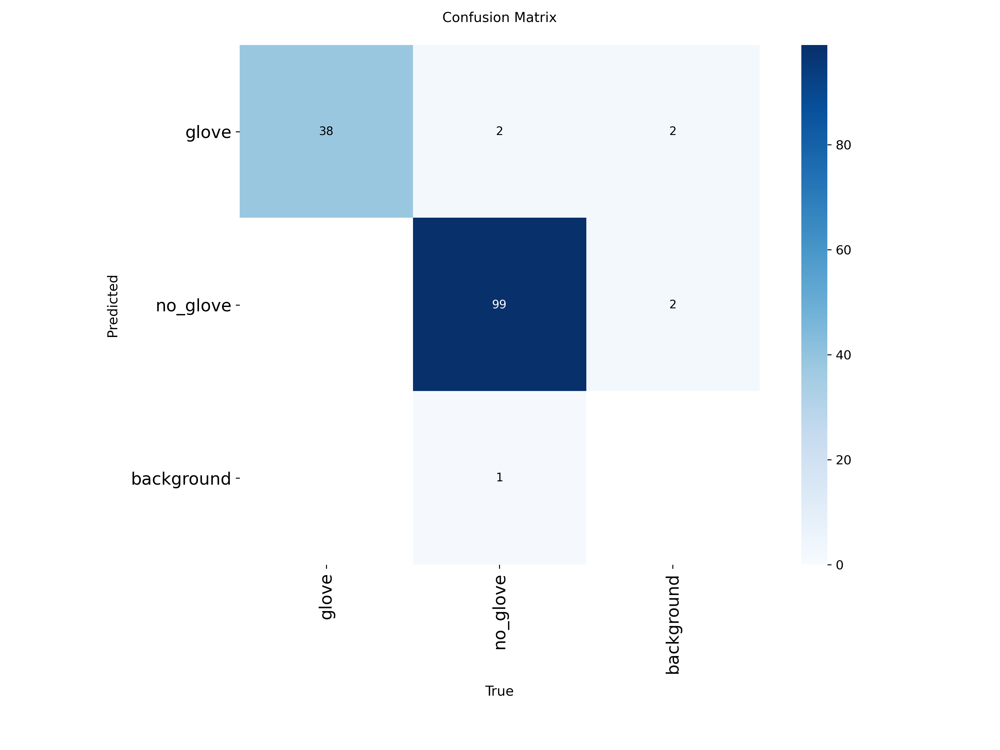
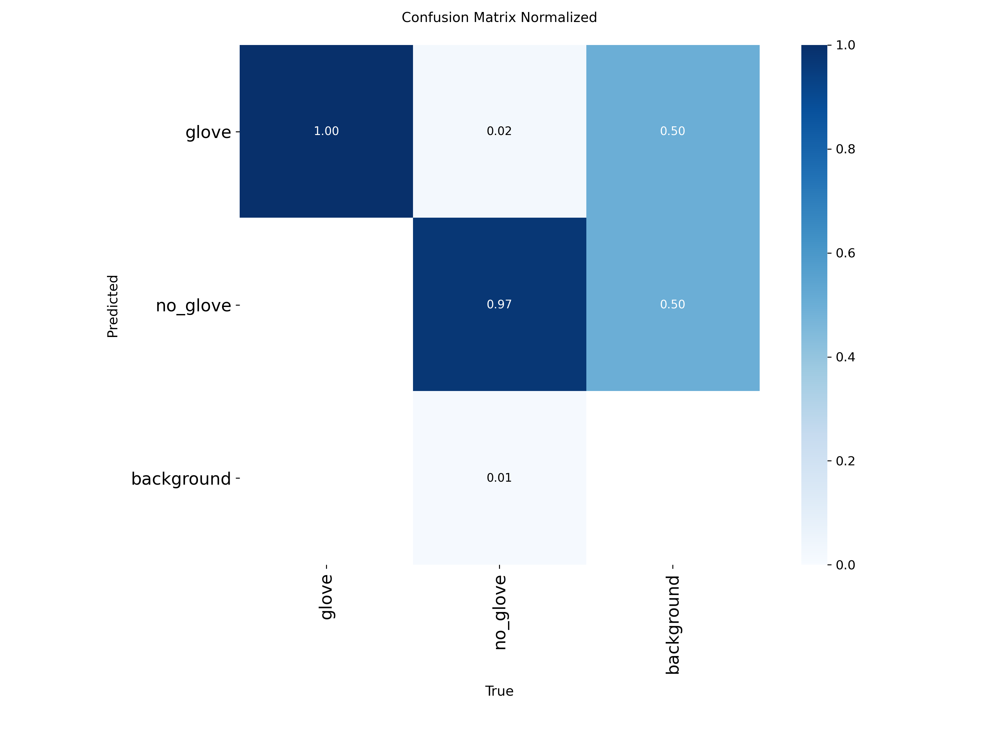
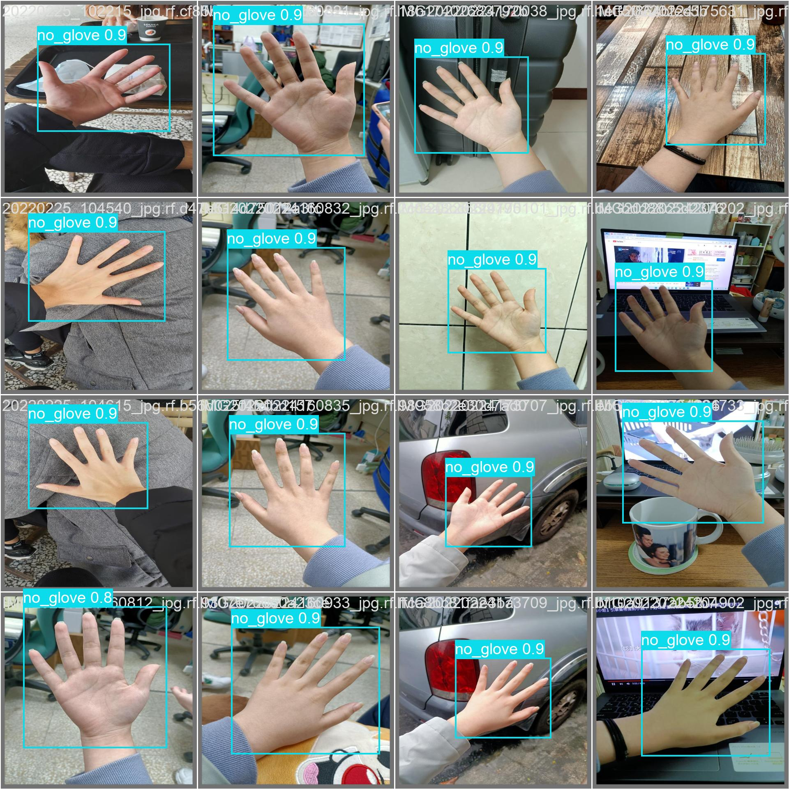
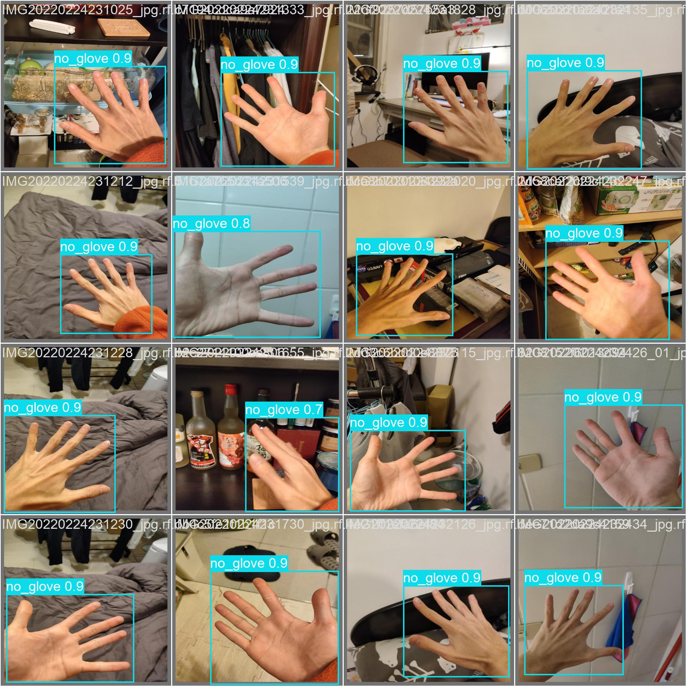
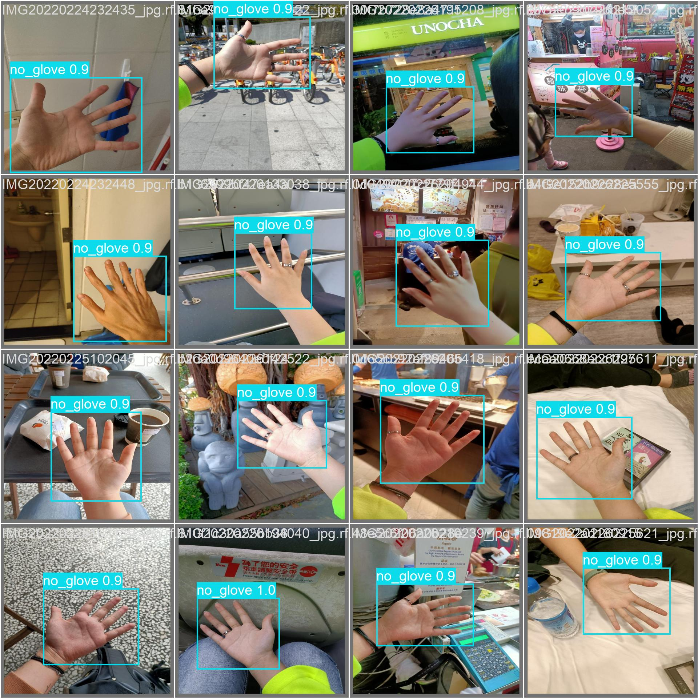

# Dataset:
Roboflow PPE Gloves Dataset 

Link: https://universe.roboflow.com/glove-uylxg/glove-q7czq

# Model:
YOLOv8n fine-tuned for 10 epochs

# Pipeline:
1. Load model
2. Run detection
3. Save annotated images
4. Save JSON logs

# Preprocessing:
Used YOLO default augmentations

# How to run:

cd Part_1_Glove_Detection

python detection_script.py --input input_images --output output

# To run full pipeline:

cd Part_1_Glove_Detection

bash run.sh

or (Windows)

cd Part_1_Glove_Detection

run.bat

# To retrain model from scratch:

cd Part_1_Glove_Detection

python train_model.py

# Arguments:

--input       Input folder of images
--output      Output folder for annotated images
--confidence  Confidence threshold
--model       Path to YOLO model

Example:

python detection_script.py --model model/best.pt --input input_images --output output

# Evaluation

Model evaluation was performed using YOLO validation.

Command used internally:

model.val()

Metrics generated:
- mAP
- Precision
- Recall
- Confusion Matrix

Validation outputs saved in:

runs/detect/val/

Example files:
- confusion_matrix.png
- confusion_matrix_normalized.png
- BoxPR_curve.png
- predictions.json

Observations:

- Model correctly detects most gloved and bare hands
- Some errors occur with motion blur or small hands
- Performance is acceptable for a safety monitoring system

## Challenges

- Small hands in image
- Motion blur
- Gloves with skin-like color
- Different lighting conditions

## What worked

YOLOv8 provided fast training and good detection accuracy.
Fine-tuning on Roboflow dataset improved performance.

## What didn’t work well

- Very small hands sometimes missed
- Similar glove/skin color causes confusion

## Possible Improvements

- More training data
- Stronger augmentation
- Larger YOLO model (yolov8m / yolov8l)
- Better labeling for edge cases

## Evaluation Results

Model validation was performed using YOLO built-in validation.

Metrics and plots were generated automatically.

### Precision–Recall Curve

This curve shows the tradeoff between precision and recall.
The model maintains high precision even at high recall.

### F1 Score vs Confidence

Best F1 score occurs around confidence ~0.55,
which matches the threshold used in detection.

### Precision vs Confidence

Precision stays high across most confidence values,
showing the model produces few false positives.

### Recall vs Confidence

Recall decreases at high confidence thresholds,
which is expected when filtering low-confidence detections.

### Confusion Matrix

Most predictions fall on the diagonal,
indicating correct classification of glove vs no_glove.

### Normalized Confusion Matrix

Shows high accuracy for both classes.

### Sample Predictions

The model correctly detects most hands and assigns the correct label.
Some minor errors occur in difficult lighting or small hand regions.

### Conclusion

The model achieves high precision and recall on the validation set,
and performs well on unseen images.

This makes it suitable for safety monitoring scenarios where
detecting bare hands vs gloved hands is required.